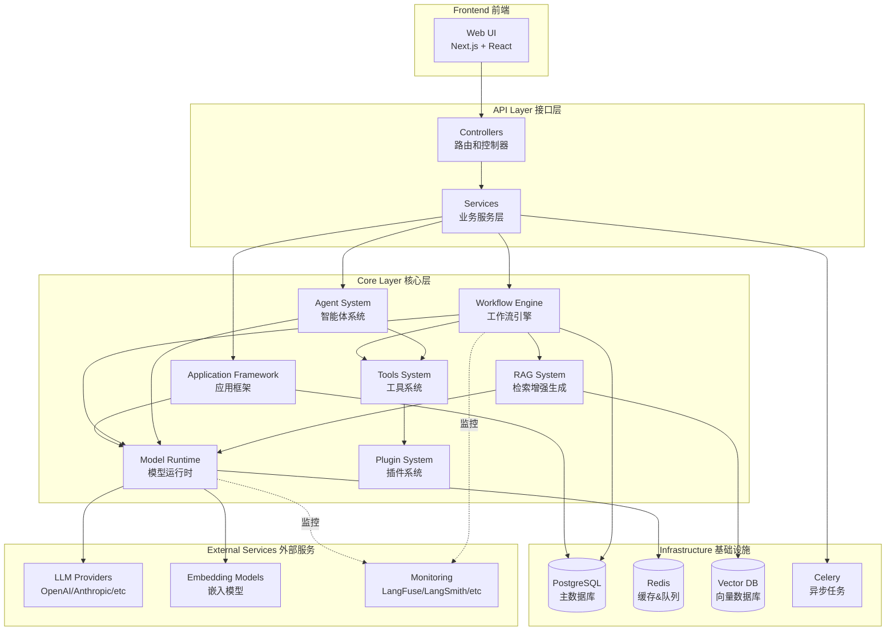
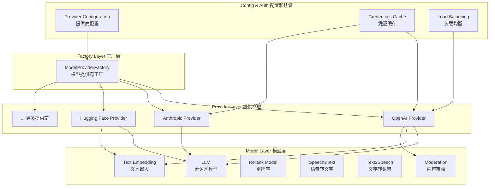
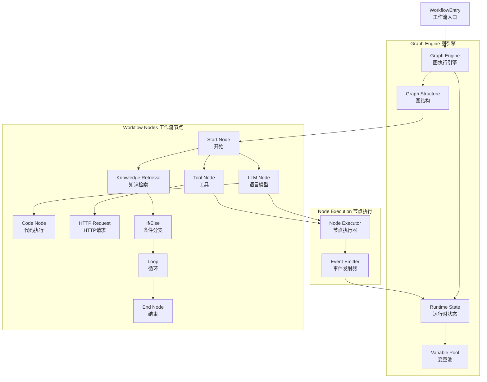
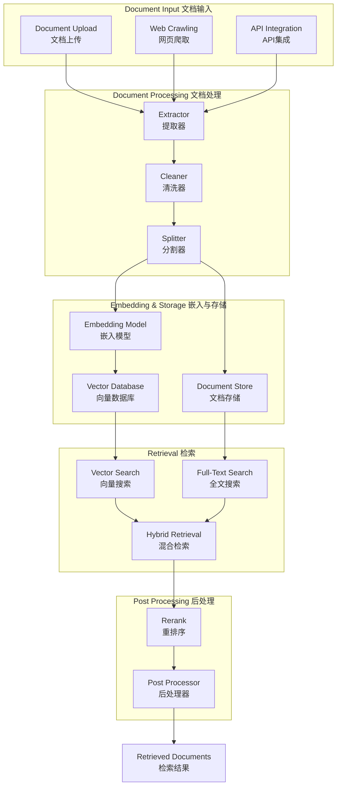
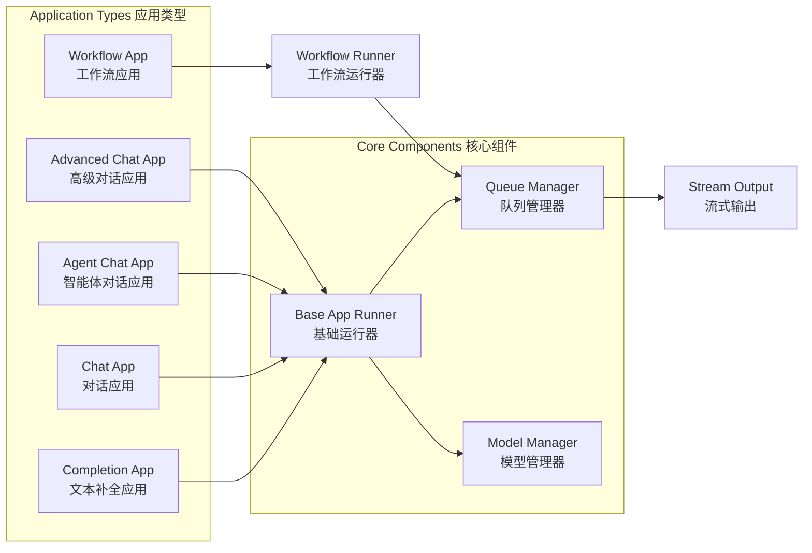
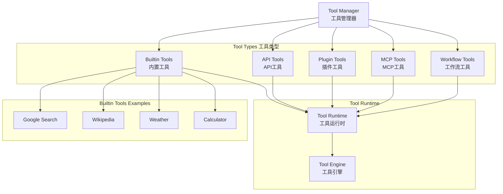
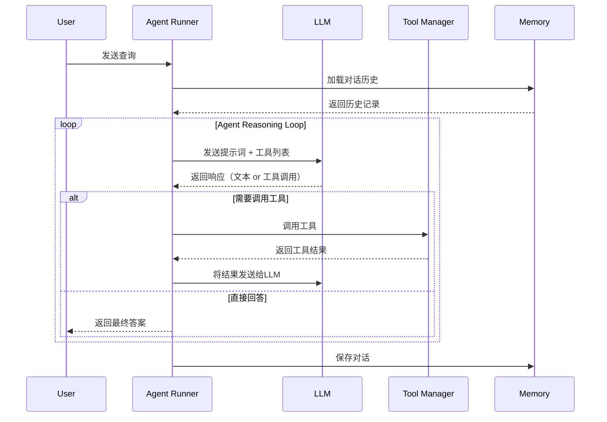
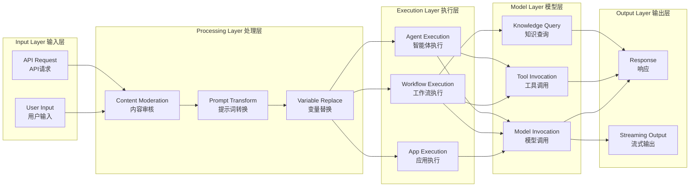
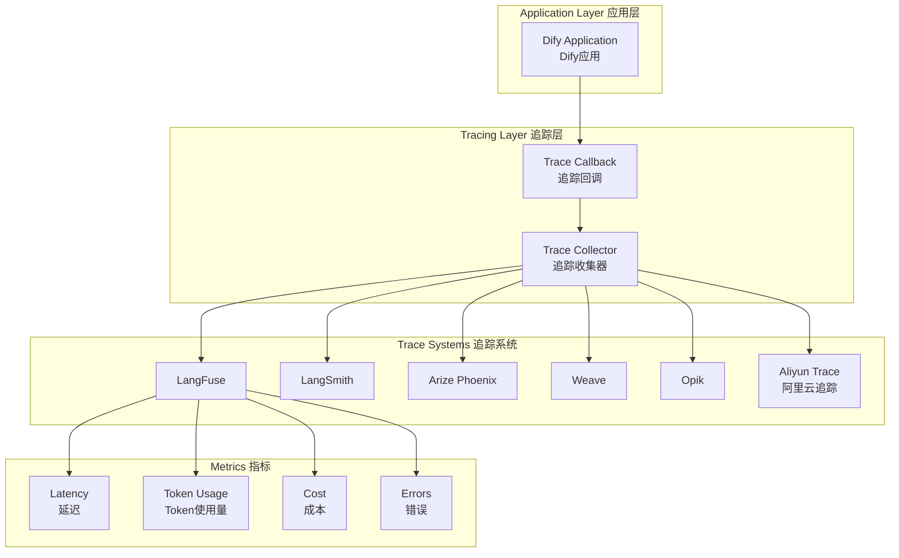
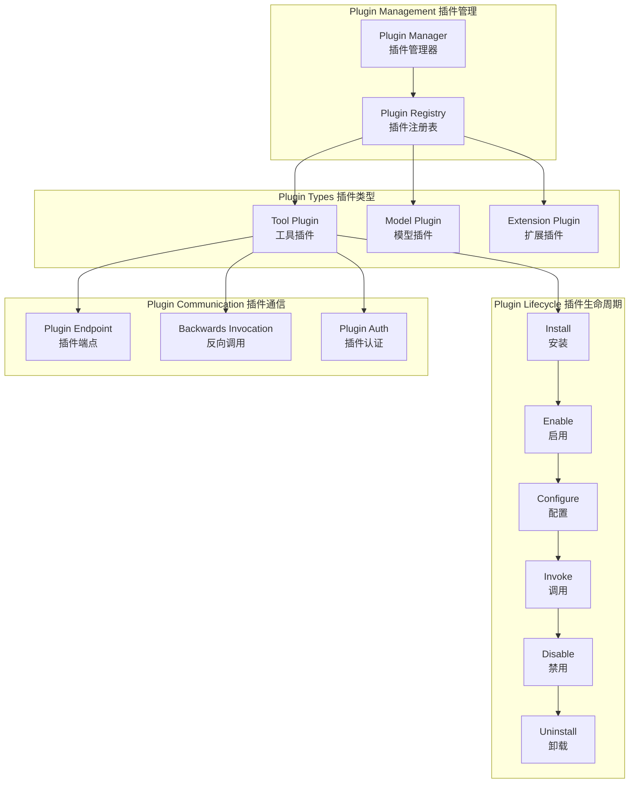

# Dify Core 架构图

## 1. 整体架构图

## 2. Model Runtime 架构

## 3. Workflow Engine 架构

## 4. RAG System 架构

## 5. Application Types 应用类型流程

## 6. Tools System 架构

## 7. Agent System 执行流程

## 8. 数据流向图

## 9. 监控和追踪架构

## 10. 插件系统架构

## 说明

这些架构图展示了 Dify Core 的主要组件和它们之间的关系：

1. **整体架构图**: 展示了从前端到后端的完整架构层次
2. **Model Runtime 架构**: 展示了模型运行时的三层架构设计
3. **Workflow Engine 架构**: 展示了工作流引擎的核心组件
4. **RAG System 架构**: 展示了从文档处理到检索的完整流程
5. **Application Types**: 展示了不同应用类型及其核心组件
6. **Tools System**: 展示了工具系统的组织结构
7. **Agent System 执行流程**: 展示了智能体的执行序列
8. **数据流向图**: 展示了数据在系统中的流动
9. **监控和追踪架构**: 展示了可观测性系统
10. **插件系统架构**: 展示了插件的生命周期和通信机制

这些图表使用 Mermaid 语法编写，可以在支持 Mermaid 的 Markdown 渲染器中查看（如 GitHub、GitLab、VS Code 等）。
